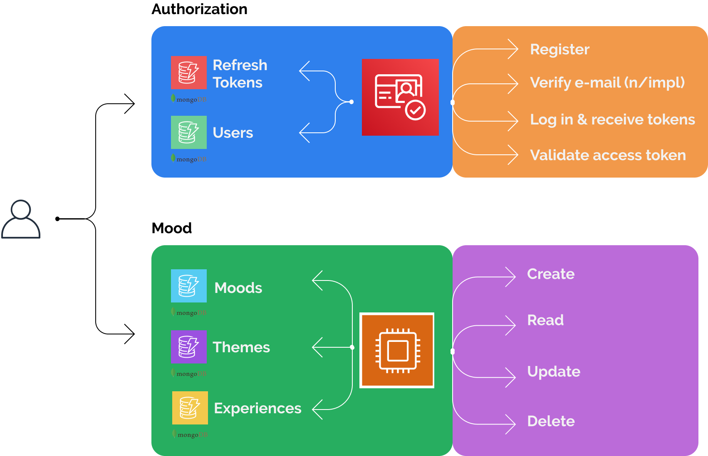

# Moodie: a moodboard that matches your emotions



## Setup

```bash
git clone https://github.com/sdll/moodie
cd moodie
docker-compose up --build
```

## Auth

_Launch the web app using `docker-compose` before accessing Swagger API, adjusting the port in accordance with the [docker-compose.yml](./docker-compose.yml) if necessary._

- [Swagger API Description](http://localhost:3010/auth/api)
- API Endpoints:
  - ​/auth​/login
  - ​/auth​/validate
  - ​/auth​/access_token
  - ​/auth​/logout
  - ​/auth​/register

## Mood

_Launch the web app using `docker-compose` before accessing Swagger API, adjusting the port in accordance with the [docker-compose.yml](./docker-compose.yml) if necessary._

- [Swagger API](http://localhost:3020/mood/api)
- API Endpoints:
  - /mood/create
  - /mood/update/experience
  - /mood/delete/experience
  - /mood/delete/theme
  - /mood/theme
  - /mood/experience
